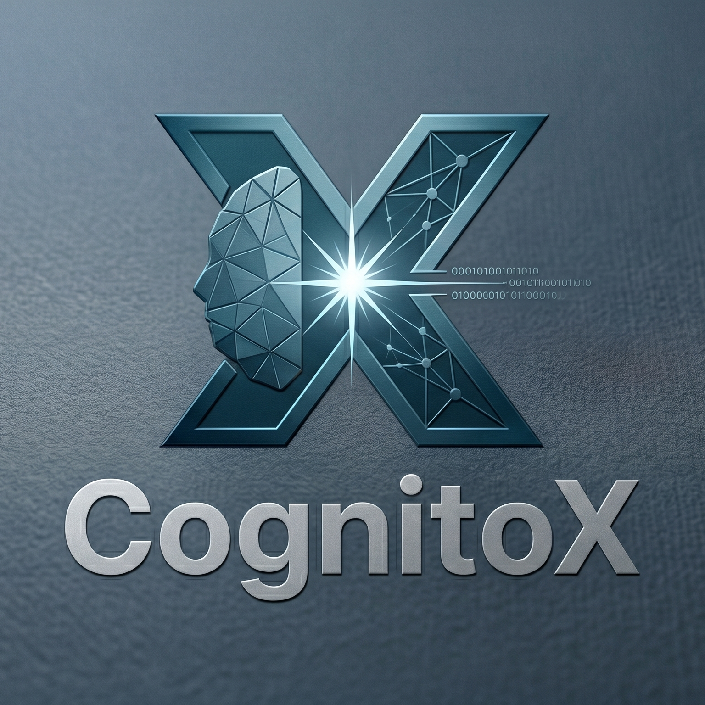
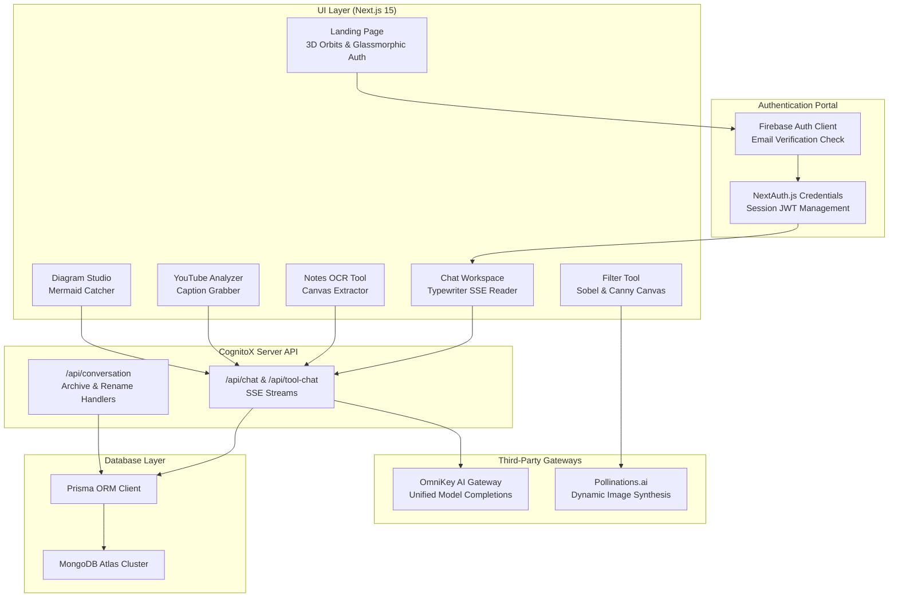
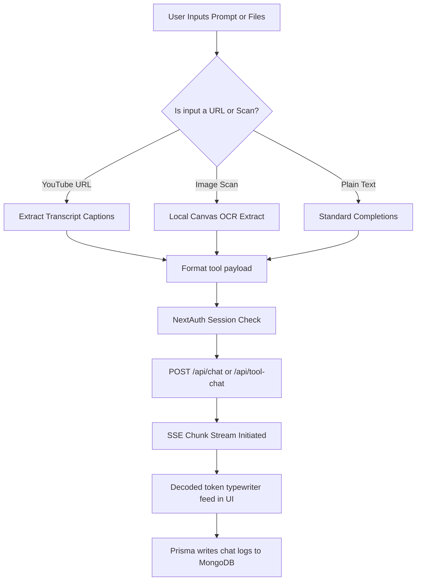

<p align="center">
  
</p>
<h1 align="center">CognitoX: Unified Intelligence Workspace</h1>
<p align="center">
  <strong>Unified Intelligence across Web, Media, Notes and Visuals</strong><br/>
  <em>Sandboxed AI workspaces with OCR, YouTube analysis, Mermaid diagrams, and edge filters</em>
</p>

<p align="center">
  
  
  
  
  
  
</p>

---

## Table of Contents

- [Overview](#overview)
- [Why CognitoX](#why-cognitox)
- [Core Workspaces](#core-workspaces)
- [System Architecture](#system-architecture)
- [Pipeline Flow and How It Works](#pipeline-flow-and-how-it-works)
- [UI Guide](#ui-guide)
- [App Resolution and Validation Logic](#app-resolution-and-validation-logic)
- [Quick Start](#quick-start)
- [Environment Configuration](#environment-configuration)
- [Deploying to Vercel](#deploying-to-vercel)
- [Project Structure and Key Components](#project-structure-and-key-components)
- [Dependencies](#dependencies)
- [Roadmap](#roadmap)
- [Troubleshooting](#troubleshooting)
- [Author](#author)

---

## Overview

**CognitoX** is a unified intelligence workspace and sandboxed cognitive platform designed to integrate web research, media transcription, scanned documents, and interactive visual generation. By combining client-side WebGL filters, Server-Sent Events (SSE) streaming completions, and MongoDB Atlas persistence, CognitoX gives you a powerful interface to structure unstructured data.

No complex local setup is required to run the AI engine—it hooks into OmniKey AI as its unified gateway and uses Pollinations.ai for dynamic visual generation. User credentials, database schemas, and tool histories are persisted via Prisma and Firebase Auth in a hybrid authentication structure.

---

## Why CognitoX

> **Most AI platforms are text-only chat interfaces. CognitoX is a tool-integrated workspace that operates on files, transcripts, and code.**

| Feature | Traditional AI Chat | CognitoX |
|---|---|---|
| **Interactivity** | Simple chat bubbles | Floating 3D visual constructs with responsive animations |
| **Document Processing** | Text pasting or slow cloud parsers | Local Canvas OCR + Sobel and Canny Edge Filters |
| **Media Crawling** | Cannot parse YouTube transcripts | Full YouTube URL crawling and auto-outline generator |
| **Diagram Studio** | Code block outputs only | Interactive Mermaid.js viewer with line-level syntax alerts |
| **Theme System** | Faint gray dark modes | Premium pitch-black (`#050505`) and crimson-orange light mode |
| **Authentication** | Basic credentials | Firebase Auth verification check + NextAuth session mapping |

---

## Core Workspaces

### 🎙️ Chatbot Workspace
* **Real-time SSE Streaming**: Queries stream token-by-token directly from the OmniKey gateway for low latency.
* **Inline History Controls**: Rename, archive, and filter conversations dynamically from the sidebar.

### 📄 Smart Notes OCR
* **Local Canvas Extraction**: Extract raw text from images and document scans client-side.
* **Format-Ready Outlines**: Structuring raw text into parsed study guides instantly via context-guided completions.

### 🎥 YouTube Analyzer
* **Transcript Extraction**: Crawl captions and transcripts from any YouTube URL.
* **Study Prep Generators**: Auto-create mock tests, outlines, and structured reviews.

### 🏗️ Diagram Studio
* **Interactive Mermaid.js Compiler**: Write text and compile it into diagrams dynamically.
* **Line-Level Syntax Alerts**: Parses errors caught during compilation and renders a line-number alert banner.

### 🎨 Image Filter Tool
* **GPU-Accelerated Filters**: Sobel edge detection, Canny filters, grayscale, and threshold adjustments via Canvas.
* **Adaptive Canvas Scaling**: Fits high-resolution images within the workspace without layout shifts.

---

## System Architecture



<details>
<summary>ASCII fallback (click to expand)</summary>

```
┌────────────────────────────────────────────────────────────────────────┐
│                        CognitoX Workspace                              │
│                                                                        │
│  ┌───────────────────────┐         ┌────────────────────────────────┐  │
│  │   UI Layer (Next.js)  │         │  Authentication Portal         │  │
│  │                       │         │                                │  │
│  │  ┌─────────────────┐  │         │  ┌──────────────┐              │  │
│  │  │  Landing Page   ├──┼────────►│  │ Firebase     │              │  │
│  │  │ (3D Constructs) │  │         │  │ Client Auth  │              │  │
│  │  └─────────────────┘  │         │  └──────┬───────┘              │  │
│  │                       │         │         ▼                      │  │
│  │  ┌─────────────────┐  │         │  ┌──────────────┐              │  │
│  │  │ Chat Workspace  │  │         │  │ NextAuth.js  │              │  │
│  │  │ (SSE Streaming) │◄─┼─────────┼──┤ Session JWT  │              │  │
│  │  └────────┬────────┘  │         │  └──────────────┘              │  │
│  └───────────┼───────────┘         └────────────────────────────────┘  │
│              │                                                         │
│              ▼                                                         │
│  ┌──────────────────────────────────────────────────────────────────┐  │
│  │                     CognitoX Server API                          │  │
│  │                                                                  │  │
│  │  ┌────────────────────────────────┐  ┌────────────────────────┐  │  │
│  │  │ /api/chat & /api/tool-chat     │  │ /api/conversation      │  │  │
│  │  │ (OmniKey Stream Completions)   │  │ (Archive & Rename)     │  │  │
│  │  └────────┬───────────────────────┘  └────────┬───────────────┘  │  │
│  └───────────┼───────────────────────────────────┼──────────────────┘  │
│              │                                   │                     │
│              ▼                                   ▼                     │
│  ┌────────────────────────┐         ┌────────────────────────────────┐  │
│  │ External Gateways      │         │ Database Layer                 │  │
│  │                        │         │                                │  │
│  │  ┌──────────────────┐  │         │  ┌──────────────┐              │  │
│  │  │ OmniKey AI       │  │         │  │ Prisma Client│              │  │
│  │  │ Gateway          │  │         │  └──────┬───────┘              │  │
│  │  └──────────────────┘  │         │         ▼                      │  │
│  │  ┌──────────────────┐  │         │  ┌──────────────┐              │  │
│  │  │ Pollinations.ai  │  │         │  │ MongoDB      │              │  │
│  │  │ Image API        │  │         │  │ Atlas Cluster│              │  │
│  │  └──────────────────┘  │         │  └──────────────┘              │  │
│  └────────────────────────┘         └────────────────────────────────┘  │
└────────────────────────────────────────────────────────────────────────┘
```

</details>

---

## Pipeline Flow and How It Works

### Flow Diagram



<details>
<summary>ASCII fallback (click to expand)</summary>

```
User Inputs Prompt / Uploads Scans
     │
     ├─► YouTube URL ──► Extract Transcript Captions
     ├─► Image Scan   ──► Local Canvas OCR Extract
     └─► Plain Text   ──► Standard Chat Prompt
           │
           ▼
Format tool payload (variant context mapping)
     │
     ▼
Validate user NextAuth session credentials
     │
     ▼
POST payload to CognitoX Server API
     │
     ▼
API communicates with OmniKey AI unified gateway
     │
     ▼
Server initiates Server-Sent Events (SSE) stream chunking
     │
     ▼
Next.js client decodes stream chunks in real-time
     │
     ▼
Render response in typewriter animation & Write to MongoDB via Prisma ORM
```

</details>

### General Processing Overview

1. **You enter the workspace** – Choose standard chat, Notes OCR, YouTube Analyzer, or Diagram Studio.
2. **Document or Media input is parsed** –
    * YouTube transcripts are crawled from the video URL.
    * Notes and image text are read client-side using a canvas OCR pipeline.
    * Code structures for Mermaid are validated by the compile handler.
3. **The API routes the payload** – The prompt is enriched with system instructions and sent to the Next.js API.
4. **SSE Stream initiates** – OmniKey processes the request and streams the completions back to the Next.js client, which renders the text dynamically without page hangs.
5. **MongoDB records the history** – Prisma commits the transaction to your MongoDB Atlas collection.

---

## UI Guide

### Workspace Layout

The chat dashboard is structured in a two-column design system:
* **Sidebar (Left)**: Active conversations, archived session toggle, and list items with hover rename and archiving actions.
* **Workspace (Right)**: The dynamic chat area where chosen tools load.

### 3D Rotating Background Constructs

* **Center-Left**: Main rotating neural construct (`.construct-3d`).
* **Top-Left**: Rotating 3D triple ring with core (`.double-ring-3d`).
* **Top-Right**: Rotating wireframe cube (`.cube-3d`).
* **Bottom-Left**: Intersecting quadruple ring with core (`.triple-ring-3d`).
* **Bottom-Right**: Pure Y-axis rotating **3D DNA double helix** with smooth bobbing motion.

### Light Theme Sun-Glow Contrast

When light mode is toggled, all orbits and connectors turn dark grey (`rgba(0,0,0,0.2)` / `rgba(0,0,0,0.55)`) and nodes turn into vibrant crimson spheres (`#dc2626` / `#ffcbd5` radial gradients), ensuring high visibility.

### Authentication Box

Uses a translucent glassmorphic panel (`rgba(10,10,10,0.45)` with `blur(16px)` in dark mode and `rgba(255,255,255,0.45)` in light mode) showing the rotating background constructs behind it. Hovering displays a neon gradient border.

---

## App Resolution and Validation Logic

For credentials verification and chat session safety, CognitoX handles logins via a multi-layered check:

```
1. Input Validation (Checks formatting of email and minimum 6-character passwords)
      │
      ▼
2. Firebase Authentication (Verifies client-side credentials)
      │
      ▼
3. Email Verification check (Enforces verified email before session init)
      │
      ▼
4. NextAuth Token Exchange (Retrieves Firebase ID Token and maps database session)
      │
      ▼
5. MongoDB Sync (Upserts User record using the Firebase UID)
```

---

## Quick Start

### Prerequisites
- **Node.js**: v18.0.0 or higher
- **Database**: MongoDB Atlas account (recommended) or local MongoDB instance
- **API Keys**: OmniKey API Key

### Installation

```bash
# 1. Clone the repository
git clone https://github.com/Felix-au/CognitoX-Unified-Intelligence.git
cd CognitoX-Unified-Intelligence

# 2. Install dependencies
npm install

# 3. Create .env file and populate variables (see env section below)
cp .env.example .env

# 4. Generate Prisma Client
npx prisma generate

# 5. (Optional) Seed the database
npx prisma db seed

# 6. Run the Next.js development server
npm run dev
```

Open [http://localhost:3000](http://localhost:3000) to view the workspace.

---

## Environment Configuration

Populate your `.env` file in the root directory with these parameters:

```env
# Database URL (MongoDB Atlas)
DATABASE_URL="mongodb+srv://<username>:<password>@<cluster_domain>/cognitox?retryWrites=true&w=majority"

# NextAuth Settings
NEXTAUTH_SECRET="use-any-random-32-character-string"
NEXTAUTH_URL="http://localhost:3000"

# OmniKey AI API Key
OMNIKEY_API_KEY="your-omnikey-api-key"

# Pollinations.ai API Key
POLLINATIONS_API_KEY="your-pollinations-key"

# Firebase Client configuration (NEXT_PUBLIC_ prefix makes variables visible to browser)
NEXT_PUBLIC_FIREBASE_API_KEY="your-firebase-key"
NEXT_PUBLIC_FIREBASE_AUTH_DOMAIN="your-app.firebaseapp.com"
NEXT_PUBLIC_FIREBASE_PROJECT_ID="your-app-id"
NEXT_PUBLIC_FIREBASE_STORAGE_BUCKET="your-app.appspot.com"
NEXT_PUBLIC_FIREBASE_MESSAGING_SENDER_ID="your-sender-id"
NEXT_PUBLIC_FIREBASE_APP_ID="your-firebase-app-id"
```

---

## Deploying to Vercel

CognitoX is optimized for deployment on Vercel. 

### Deployment Steps
1. Push your code to a GitHub repository.
2. Import the repository into your Vercel Dashboard.
3. Configure the environment variables (listed in the `.env` section) in the Vercel Project Settings.
4. Click **Deploy**. Vercel will automatically build the Next.js package, run compile checks, and publish the application.
5. In your Firebase console, ensure the Vercel deployment domain is added to the **Authorized Domains** list under Authentication settings.

---

## Project Structure and Key Components

```
CognitoX/
├── prisma/
│   ├── schema.prisma            # MongoDB database models & enums
│   ├── seed.ts                  # Database seeder scripts
│   └── verify-conn.ts           # Mongo connection validation checker
├── public/
│   ├── logo.png                 # Main CognitoX logo
│   └── favicon.ico              # Browser icon
├── src/
│   ├── app/                     # Next.js App router
│   │   ├── api/                 # API endpoints
│   │   │   ├── chat/            # Standard completions stream endpoint
│   │   │   ├── tool-chat/       # Tool completions stream endpoint
│   │   │   └── conversation/    # Archive/Rename session handlers
│   │   ├── chatbot/             # Chat workspace pages
│   │   ├── layout.tsx           # Main template configuration (forces dark theme)
│   │   ├── page.tsx             # Landing Page (3D visual CSS engine)
│   │   └── globals.css          # Tailwind and color palette stylesheets
│   ├── components/              # React components
│   │   ├── tool/                # CognitoX Tool Workspaces
│   │   │   ├── DiagramsTool.tsx # Mermaid workspace
│   │   │   ├── ImageFilterTool.tsx # Canvas filter tool
│   │   │   ├── NotesTool.tsx    # Notes OCR compiler
│   │   │   └── YoutubeVideoTool.tsx # Media analysis tool
│   │   └── MermaidChart.tsx     # Catcher for Mermaid compile errors
│   ├── lib/                     # Helper modules
│   │   ├── firebase-client.ts   # Firebase client instantiation
│   │   ├── auto-search.ts       # DuckDuckGo fallback scraper
│   │   └── files.ts             # PDF layout screenshot generators
│   └── providers/               # App context providers
│       ├── NextAuthProvider.tsx # NextAuth session provider
│       └── ToastProvider.tsx    # Toast notifications provider
├── package.json                 # Next.js scripts & packages
├── tsconfig.json                # TS configurations
└── README.md                    # Project documentation
```

### Key Modules and Roles

| Component | Path | Role |
|---|---|---|
| **Landing Page** | `src/app/page.tsx` | Hosts login panel, theme settings, and 3D visual CSS engine. |
| **Notes OCR** | `src/components/tool/NotesTool.tsx` | Renders OCR extraction layouts and formats summaries via streaming. |
| **YouTube Analyzer** | `src/components/tool/YoutubeVideoTool.tsx` | Processes YouTube captions and structures outlines. |
| **Diagram Studio** | `src/components/tool/DiagramsTool.tsx` | Visualizes Mermaid diagrams and processes line-level error flags. |
| **Canvas Filters** | `src/components/tool/ImageFilterTool.tsx` | Runs Sobel/Canny shaders on images locally on canvas. |
| **Mermaid Compiler** | `src/components/MermaidChart.tsx` | Captures Mermaid exceptions and extracts syntax line numbers. |

---

## Dependencies

| Package | Purpose |
|---|---|
| `next` | Next.js 15 app router framework |
| `prisma` | Database schema compiler |
| `@prisma/client` | MongoDB database transaction generator |
| `firebase` | Client login management |
| `next-auth` | Server session JWT tokens manager |
| `pdf-to-png-converter` | PDF parser screenshot generator |
| `mermaid` | Diagram compilation engine |
| `lucide-react` | Branded interface icons |
| `tailwindcss` | Utility styling classes |

---

## Roadmap

### Current Status

| Feature | Description | Status |
|---|---|---|
| **SSE Streaming** | Token-by-token streaming for chatbot and tool workspace components |  Released |
| **Archiving Controls** | Inline controls in sidebar to rename/archive histories |  Released |
| **3D Spherical Nodes** | Radial-shaded nodes with off-center highlights |  Released |
| **Glassmorphic Login** | Translucent auth card displaying background constructs |  Released |
| **Single-Direction Helix** | Pure Y-axis rotating DNA helix animation |  Released |

### Future Intentions
- **Dynamic Canvas Draw**: Add text overlay annotations on image scans within the Image Filter workspace.
- **Shared Workspace Links**: Generates read-only public URLs to share Mermaid diagrams and note summaries.
- **Collaborative Notes**: Real-time collaborative note sheets editing for team workspaces.

---

## Troubleshooting

### PDF parser version mismatch
If you receive an API mismatch exception from pdfjs-dist:
Ensure the pdfjs worker version aligns with your client package. CognitoX forces the worker override internally inside `src/lib/files.ts`.

### Login throws "Email Not Verified"
If you register a new account, check your inbox for the Firebase verification link. CognitoX blocks logins until the email address is verified.

### Mermaid diagram fails to render
If the editor outputs a red banner, review the syntax error line number in the alert box. The banner shows the exact line number where the Mermaid parser encountered the syntax exception.

### Image filter returns canvas failure
Ensure the image is loaded locally. Client-side canvas operations (like Sobel and Canny shaders) are blocked by CORS if the image is loaded from an unconfigured external domain.

---

## Author

**Felix-au** (Harshit Soni)

- 🔗 GitHub: [github.com/Felix-au](https://github.com/Felix-au)
- 📧 Email: [harshit.soni.23cse@bmu.edu.in](mailto:harshit.soni.23cse@bmu.edu.in)

---

<p align="center">
  <sub>Built to consolidate cognitive workloads into a single local-first workspace.</sub>
</p>
